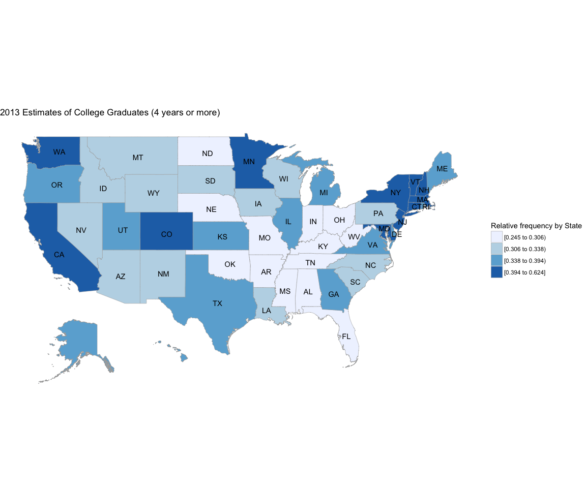
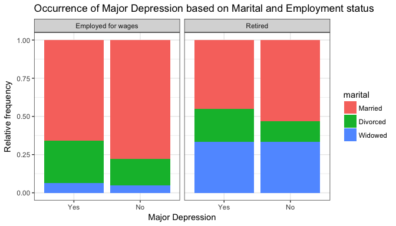
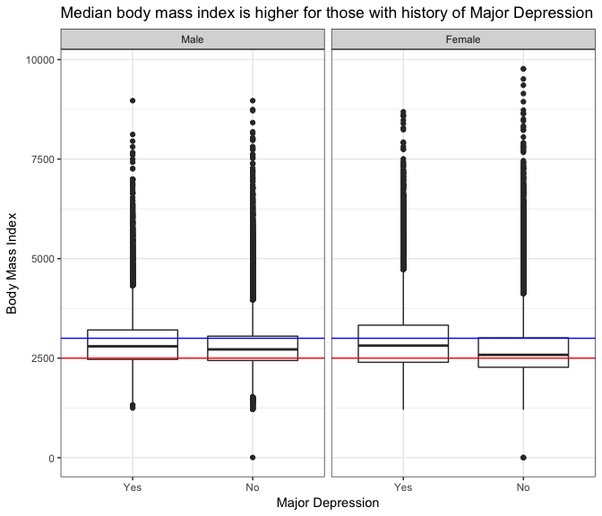

# Exploring the BRFSS data
Dale Richardson  
`r format(Sys.Date(), "%B %d, %Y")`  

## Setup

### Overview

This document is an Exploratory Data Analysis (EDA) of the 2013 [Behavioral Risk Factor Surveillance System (BRFSS)](https://cdc.gov/brfss) data that has been provided to students of the Coursera course, [Introduction to Probability and Data](https://www.coursera.org/learn/probability-intro/home/info), taught by Duke University. 

The primary objective of the BRFSS is to, "collect uniform, state-specific data on preventive health practices and risk behaviors that are linked to chronic diseases, injuries, and preventable infectious diseases that affect the adult population." 

For more information on the BRFSS, please see the [Centers for Disease Control and Prevention overview](https://www.cdc.gov/brfss/annual_data/2013/pdf/Overview_2013.pdf). 

In this document, I will briefly comment on the data itself (how it was collected and if causality can be inferred), suggest three research questions based on the variables measured in the dataset and lastly perform the exploratory analyses to address the research questions. 

We begin by loading necessary R packages and the BRFSS data itself. 

### Load packages


```r
library(ggplot2)
library(dplyr)
```

### Load data


```r
load("brfss2013.RData")
```


* * *

## Part 1: Data

As noted above, the data analyzed here were obtained from the 2013 Behavioral Risk Factor Surveillance System (BRFSS) survey, administered by the Centers for Disease Control's Population Health Surveillance Branch. The data are based on a population of non-institutionalized adults residing in all 50 states of the USA and its territories, who are at least 18 years old and who have a landline or cellular telephone. Results based on these data are **NOT** generalizable beyond the aforementioned population from which the samples were obtained, e.g. not to a population under 18 years of age, nor to those living outside of the USA and its territories. 

These data were collected by using a disproportionate stratified sampling design followed by simple random sampling of strata in 51 projects, whereas only simple random sampling was employed in Guam and Puerto Rico. Disproportionate stratified sampling was used in order to ensure that enough members of underrepresented groups would be included in the samples. For more details, please see page 6 of the [BRFSS overview](https://www.cdc.gov/brfss/annual_data/2013/pdf/Overview_2013.pdf).

These data comprise an in-depth observational study, without random assignment of subjects into experimental/control groups. Therefore, it is **NOT** possible to infer causality based on these data. 

With any survey, it is important to consider sources of potential bias. One potential bias that should be considered is non-response. For example, perhaps very busy people are underrepresented, or people who work nights and sleep during the day, thus would be absent during the times of the phone calls. 

Additionally, there may be an inherent bias between individuals/households who primarily use cell phones instead of landlines, i.e. perhaps people who only use cell phones are younger and more mobile whereas those who maintain landlines spend more time at home. Another potential source of bias could arise from the demeanor of the interviewer conducting the survey over the telephone. If the interviewer's performance was sub-standard or somehow offputting, this could affect the responsiveness of the participant. 


* * *

## Part 2: Research questions

**Research quesion 1:**

The first question I have is the following: 

Of the 50 states in the U.S.A, which have the highest proportion of college graduates? Or, in other words, is the distribution of college graduates uniform across the USA? The variables of interest here are, `education level` and `state of residence`. The question could be considered interesting from the standpoint of subsetting the U.S population by education level and then looking at other indicators of health -- moving towards to the hypothesis that having a higher education results in a healthier populace.

**Research quesion 2:**

The second question I have come up with is the following:

How does marital status and employment status correlate with the incidence of having been told that one has major depression? In other words, are retired people more happy than employed people, and does this happiness change depending on if one is married or divorced? The variables of interest here are `employment status`, `marital status` and `depression status`.


**Research quesion 3:**

The final question is the following:

Are those people who have been told they have major depression overweight and is there a difference between the sexes?

The variables of interest here are `addepev2`, `sex` and `X_bmi5`. The underlying hypothesis here is that there will be a difference in body mass index across the sexes and that those who are overweight or obese will tend to be more depressed. 

* * *

## Part 3: Exploratory data analysis

Here you will find the relevant `R` code and descriptions on how I have processed the `brfss2013` data set to answer my research questions. 

**Research quesion 1:**

Of the 50 states in the U.S.A, which have the highest proportion of college graduates? To answer this question, I will filter the `brfss2013` data by the variable `educa` and then create a choropleth plot of the relative frequencies of college graduate by state. 


```r
## First subset the dataframe to obtain only the state column and the educa column
collegeGradsbyState <- brfss2013 %>% select(X_state, educa)

## group by state and education level, get total number of respondents per state
## and calculate relative frequency of each education level
collegeGradsbyState <- collegeGradsbyState %>% group_by(X_state, educa) %>%
        summarise(total = n()) %>% 
        mutate(freq = total / sum(total))

## filter rows to get frequencies of college graduates only, select only state and freq,
## rename to region and value, transform to lowercase and remove Guam + Puerto Rico for choroplethr plotting
forPlotting <- collegeGradsbyState %>% 
        filter(educa == "College 4 years or more (College graduate)") %>% 
        mutate(region = X_state, value = freq) %>% 
        ungroup() %>% 
        select(region, value) %>% 
        mutate_each(funs(tolower), matches("region")) %>%
        filter(region != "guam") %>%
        filter(region != "puerto rico")

## Show the top ten states with highest relative frequency of College graduates
library(knitr)
top10 <- head(
        arrange(forPlotting, desc(value)),10)

kable(top10, caption = "Top 10 States with highest relative frequency of College Graduates",
      align = c("c", "r"))
```


Table: Top 10 States with highest relative frequency of College Graduates

        region               value
----------------------  ----------
 district of columbia    0.6240114
     connecticut         0.4373541
    massachusetts        0.4328843
       colorado          0.4292622
       maryland          0.4272539
       new york          0.4195345
      minnesota          0.4116457
       vermont           0.4114518
      washington         0.4075435
      california         0.3983330

```r
## Show the bottom 10 states
bot10 <-head(
        arrange(forPlotting, value),10)

kable(bot10, caption = "Top 10 States with lowest relative frequency of College Graduates",
      align = c("c", "r"))        
```


Table: Top 10 States with lowest relative frequency of College Graduates

    region            value
---------------  ----------
 west virginia    0.2446177
   arkansas       0.2634776
   kentucky       0.2638595
    alabama       0.2650269
   tennessee      0.2720550
  mississippi     0.2739836
   missouri       0.2829446
    indiana       0.2854517
   oklahoma       0.2908782
   nebraska       0.2920240

```r
## load choroplethr and choroplethrMaps
library(choroplethr)
library(choroplethrMaps)

state_choropleth(forPlotting,
                 title      = "2013 Estimates of College Graduates (4 years or more)",
                 legend     = "Relative frequency by State",
                 num_colors = 4)
```

<!-- -->

```r
## detach packages to avoid conflicts with dplyr
detach("package:choroplethr", unload = TRUE)
detach("package:choroplethrMaps", unload = TRUE)
detach("package:acs", unload = TRUE)
detach("package:plyr", unload = TRUE)
```

The distribution of college graduates (4 years or more) is **not uniform** across the U.S.A. Interestingly, the *highest proportion of graduates reside in the District of Columbia*, while the *lowest proportion of degree holders reside in West Virginia*. Perhaps this high number of college degree holders in the District of Columbia can be attributed to the high concentration of politics and government-related careers in DC. Generally, the Northeast and West Coast of the United States are home to a higher proportion of 4-year college graduates, along with states like Colorado and Minnesota. The states with the lowest percentages of college graduates are the southern states, along with some mid-western states such as Nebraska and Oklahoma.  

**Research quesion 2:**

How does marital status and employment status correlate with the incidence of having been told that one has major depression? In other words, are retired people more happy than employed people, and does this happiness change depending on if one is married or divorced? 

To answer this question, I will use the following variables:
- `addepev2`: corresponds to whether or not the participant has ever been told he or she has major depressive disorder
- `employ1`: employment status
- `marital`: marital status. 

I will filter the brfss2013 dataframe to pull out only those cases where people are either `Employed for wages` or `Retired` and have been/are `Divorced`, `Married` or `Widowed`.


```r
## subset the original dataframe to grab only the variables of interest
depressedorNot <- brfss2013 %>% select(addepev2, employ1, marital) %>%
        filter(employ1 == "Employed for wages" | employ1 == "Retired") %>%
        filter(marital == "Divorced" | marital == "Married" | marital == "Widowed") %>%
        filter(!is.na(addepev2))

## group by each variable
depressedorNotGrouped <- depressedorNot %>% group_by(addepev2, employ1, marital)

## create summary of counts and relative frequencies for each class
forPlotting <- depressedorNotGrouped %>%
        summarise(n = n()) %>%
        mutate(freq = n / sum(n))

## Show the table
kable(forPlotting, caption = "Table of counts and relative frequencies of Major Depression based on Marital and Employment status", align = c("c", "r")) 
```


Table: Table of counts and relative frequencies of Major Depression based on Marital and Employment status

 addepev2               employ1   marital          n     freq    
----------  -------------------  ----------  -------  -----------
   Yes       Employed for wages   Married      15031   0.6588787 
   Yes       Employed for wages   Divorced      6348   0.2782624 
   Yes       Employed for wages   Widowed       1434   0.0628589 
   Yes                  Retired   Married       8959   0.4491853 
   Yes                  Retired   Divorced      4297   0.2154425 
   Yes                  Retired   Widowed       6689   0.3353723 
    No       Employed for wages   Married     100415   0.7799344 
    No       Employed for wages   Divorced     21905   0.1701386 
    No       Employed for wages   Widowed       6428   0.0499270 
    No                  Retired   Married      56818   0.5297617 
    No                  Retired   Divorced     14725   0.1372935 
    No                  Retired   Widowed      35709   0.3329448 

```r
## plot relative frequencies with a stacked bar plot
ggplot(forPlotting,aes(x = addepev2, y = freq,fill = marital)) + 
    geom_bar(position = "fill",stat = "identity") + facet_wrap(~employ1) +
        ggtitle("Occurrence of Major Depression based on Marital and Employment status") +
        xlab("Major Depression") +
        ylab("Relative frequency") +
        theme_bw()
```

<!-- -->

The above plot suggests a few interesting trends. For one, those who currently employed for wages have a higher proportion of people who are married, irrespective of depressive status than those who are retired. This could be explained in part by the higher proportion of widowers in the Retired group. It is quite interesting to note no difference in the proportion of major depression in the retired widowers. One would assume that the incidence of depression would be higher in those cases where one has lost their spouse, but we do not see this reflected here. Unsurprisingly, the fraction of those people who have been told they have or have had major depression is higher in the divorced groups, regardless of employment status. Lastly, and also unsurprisingly, married individuals are less likely to have been told they have or have had major depression, irrespective of employment status.


**Research quesion 3:**

Are those people who have been told they have major depression overweight and is there a difference between the sexes?

To answer this question, I will once again subset the `brfss2013` dataframe and pull out only the relevant variables "needed" to address this question. From the codebook, I will use the following variables: 

- `addepev2`: have been told has major depressive disorder
- `sex`: male or female
- `X_bmi5`: calculated body-mass index, with 2 implied decimal places


```r
## subset the original dataframe to grab only the variables of interest, remove all NAs
depressedBMI <- brfss2013 %>% select(addepev2, sex, X_bmi5) %>%
        na.omit()

## look at summary
sums <- summary(depressedBMI)
kable(sums, caption = "Five-number summary", align = c("c", "r"))
```


Table: Five-number summary

       addepev2               sex        X_bmi5  
---  ------------  --------------  --------------
      Yes: 91249    Male  :196221   Min.   :   1 
      No :371851    Female:266879   1st Qu.:2367 
          NA                   NA   Median :2663 
          NA                   NA   Mean   :2782 
          NA                   NA   3rd Qu.:3081 
          NA                   NA   Max.   :9769 

```r
## compare IQRs
iqrs <- aggregate(X_bmi5~addepev2+sex, depressedBMI, IQR)
kable(iqrs, caption = "Inter quartile ranges of BMI by Sex and Major Depression", align = c("c","r"))
```


Table: Inter quartile ranges of BMI by Sex and Major Depression

 addepev2       sex   X_bmi5 
----------  -------  --------
   Yes         Male    740   
    No         Male    611   
   Yes       Female    932   
    No       Female    740   

```r
## plot boxplots faceted by sex, abline denotes BMI marking "overweight"
ggplot(depressedBMI, aes(addepev2, X_bmi5)) + geom_boxplot() + facet_wrap(~sex) +
        geom_hline(yintercept = 2500, colour = "red") +
        geom_hline(yintercept = 3000, colour = "blue") +
        ggtitle("Median body mass index is higher for those with history of Major Depression") +
        xlab("Major Depression") +
        ylab("Body Mass Index") +
        theme_bw()
```

<!-- -->

Here we can see an interesting trend regarding history of major depression and body mass index. For one, irrespective of history of depression or sex, the majority of participants are overweight or obese, as indicated by the medians being above the horizontal red line at `BMI = 2500`, which marks the limit for being overweight. The blue line marks the BMI corresponding to obesity (`BMI = 3000`) Interestingly, the non-depressed females have a median BMI closer to 2500, suggesting that more non-depressed females are at a healthy weight/BMI. Another thing to note is the incredibly right-skewed data. There are extremely long tails in the alarmingly high BMI ranges as indicated by the outliers. 

For both males and females, those with a history of major depression tend to have higher BMIs than those without a history of major depression. Furthermore, there appears to be more variability in BMI in females as evidenced by the larger interquartile ranges. For example, the IQR is higher in depressed females (`932`) in contrast to depressed males (`740`). The same is true for the non-depressed individuals: we see that non-depressed females have a larger IQR than non-depressed males, `740 vs. 611`, respectively. Understanding why there is more variability in the female BMI is hard to discern without further analysis. One could speculate that female BMI could more variable on account of the influence of advertisements and other cultural pressures to be thin. This could create scenarios of extreme dieting, which could increase variability in BMI. 

